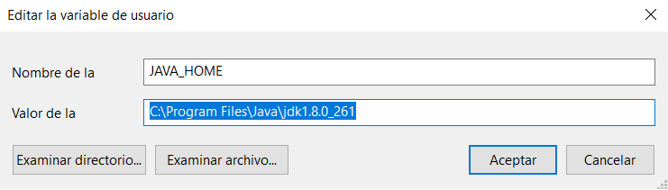
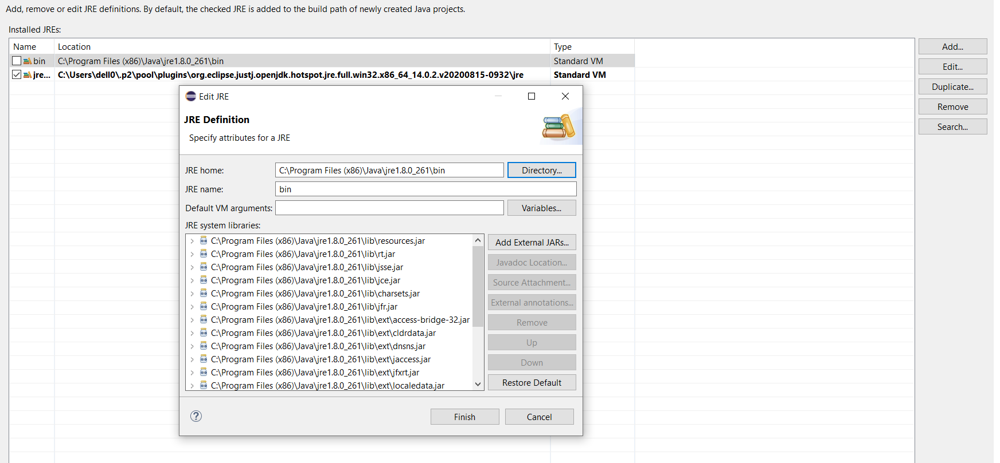
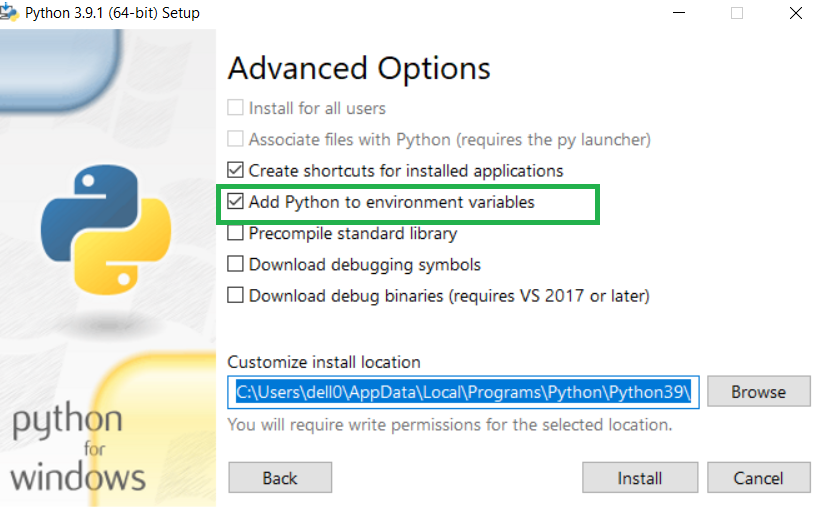
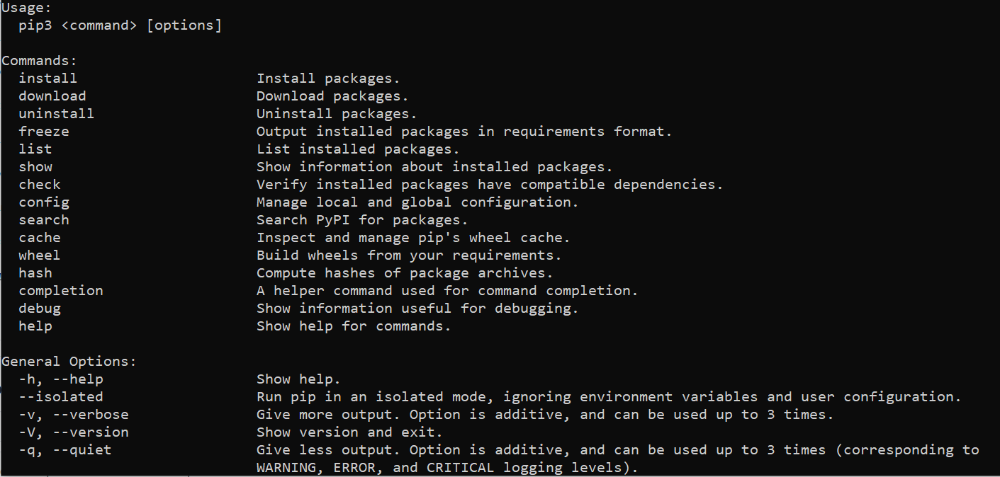
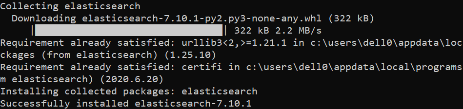
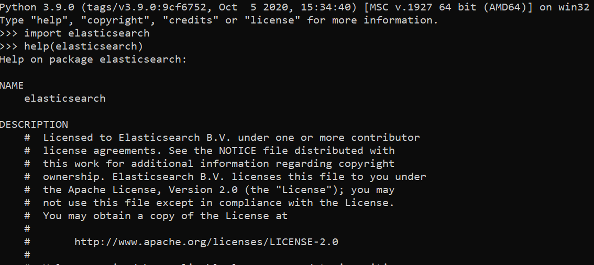
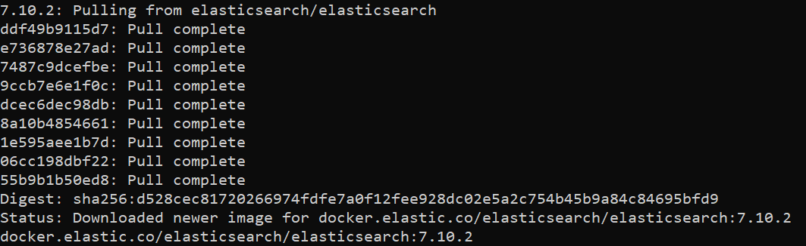

# motores_busqueda_open_source

# Entorno desarrollo Java:
## Instalación del JDK 1.8

*https://www.oracle.com/es/java/technologies/javase/javase-jdk8-downloads.html

java -version

java version "1.8.0_261"
Java(TM) SE Runtime Environment (build 1.8.0_261-b12)
Java HotSpot(TM) 64-Bit Server VM (build 25.261-b12, mixed mode)

## Añadir variable de entorno JAVA_HOME en el sistema operativo

### Windows

PASO 1: CONFIGURAR LA VARIABLE JAVA_HOME

JAVA_HOME es una variable de entorno del sistema que informa al sistema operativo sobre la ruta donde se encuentra instalado Java.
Para configurar esta variable lo podemos hacer desde la opción Configuración avanzada del sistema /  Variables de entorno... -> Nueva (Variables del sistema).

Nombre de variable: JAVA_HOME

Valor de variable: C:\Program Files\Java\jdk1.8.0_261 

PASO 2: CONFIGURAR LA VARIABLE PATH

PATH es una variable de entorno del sistema que informa al sistema operativo sobre la ruta de distintos directorios esenciales para el funcionamiento del ordenador. Vamos a añadir al contenido de la variable PATH el lugar donde se encuentran los ficheros ejecutables de Java necesarios para su ejecución, como el compilador (javac.exe) y el intérprete (java.exe). Seguiremos la siguiente secuencia de pasos para configurar esta variable.

Configuración avanzada del sistema /  Variables de entorno... -> buscamos en Variables del sistema la variable Path, pulsamos para seleccionarla y hacemos click en el botón Editar.

Nombre de variable: PATH

Valor de variable: C:\WINDOWS;C:\WINDOWS\system32;%JAVA_HOME%\bin

### Linux

*https://openjdk.java.net/install/

Se recomienda instalar la versión del openjdk y exportar la variable de entorno JAVA_HOME

$ export $JAVA_HOME=usr/lib/jvm/java-8-openjdk-amd64

## Instalación de Eclipse

https://www.eclipse.org/eclipseide/

Desde el entorno de Eclipse podríamos indicarle la versión de java y la ruta de nuestra instalación del JRE(Java Runtime Environment)

# Entorno desarrollo Python:

## Instalación de Python3.Podríamos utilizar la versión 3.9

https://www.python.org/downloads

Al realizar la instalación,marcar el check que permite añadir la ruta de instalación a las variables de entorno

Python 3.9.0 (tags/v3.9.0:9cf6752, Oct  5 2020, 15:34:40) [MSC v.1927 64 bit (AMD64)] on win32
Type "help", "copyright", "credits" or "license" for more information.
>>>

## Instalación de módulos en python

La instalación de módulos se realizar a través del comando pip3 que permite instalar en tu máquina algunos de los paquetes que luego podemos usar desde
nuestro script de forma programática.

Por ejemplo,si queremos instalar el módulo de elasticSearch tenemos que usar el comando.

$ pip3 install elasticsearch

Podríamos probar que el módulo se encuentra correctamente instalado en tu máquina si realizamos un import del módulo

## Instalación de entorno PyCharm versión community(Opcional) 

https://www.jetbrains.com/es-es/pycharm/download/?fromMenu#section=windows

# Uso de Docker como plataforma open source:
La mayoría de herramientas que se pueden instalar de forma local descargando los paquetes y dependencias,su instalación se puede simplificar utilizando imágenes de Docker.

Por ejemplo, si queremos levantar una instancia de ElasticSearch bastaría con tener Docker instalado y usando un comando de Docker podríamos levantar un servidor de Elastic con una única instrucción:

$ docker pull docker.elastic.co/elasticsearch/elasticsearch

Posteriormente, podemos ejeuctar la imagen con el siguiente comando:

$ docker run -p 9200:9200 -p 9300:9300 -e "discovery.type=single-node" docker.elastic.co/elasticsearch/elasticsearch:7.10.2

De esta forma, tenemos levantada una instancia de un servidor de elasticSearch como podemos comprobar al ejecutar el comando:

$ docker ps
CONTAINER ID        IMAGE                                                  COMMAND                  CREATED              STATUS              PORTS                               
a0db60bd4771        docker.elastic.co/elasticsearch/elasticsearch:7.10.2   "/tini -- /usr/local…"   About a minute ago   Up About a minute   0.0.0.0:9200->9200/tcp, 0.0.0.0:9300->9300/tcp

Si realizamos una petición al puerto 9200, podemos ver como tenemos nuestra instancia de elastic en ejecución.

$ curl http://localhost:9200/

{
"name": "a0db60bd4771",
"cluster_name": "docker-cluster",
"cluster_uuid": "C95oznuMQOC-Eh07ZbiCsg",
"version": {
"number": "7.10.2",
"build_flavor": "default",
"build_type": "docker",
"build_hash": "747e1cc71def077253878a59143c1f785afa92b9",
"build_date": "2021-01-13T00:42:12.435326Z",
"build_snapshot": false,
"lucene_version": "8.7.0",
"minimum_wire_compatibility_version": "6.8.0",
"minimum_index_compatibility_version": "6.0.0-beta1"
},
"tagline": "You Know, for Search"
}

La documentación oficial de Docker la podemos encontrar en https://docs.docker.com/
